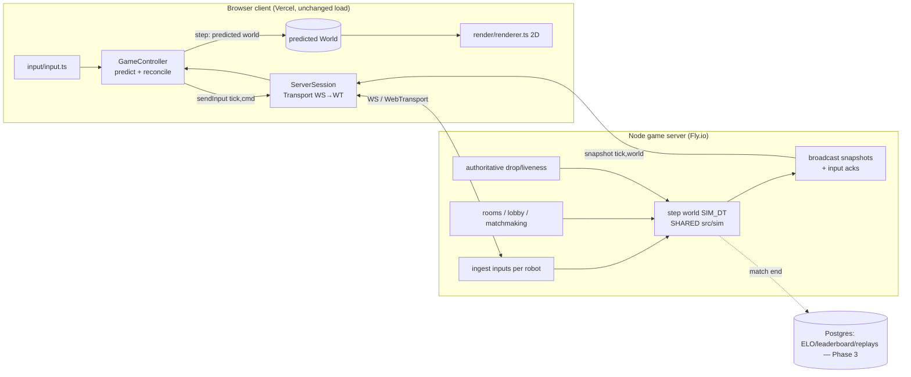
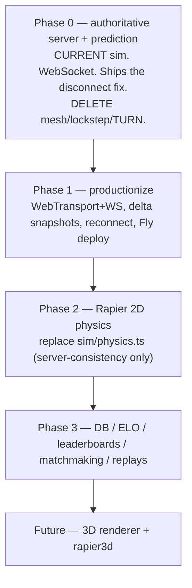

# Netcode & Physics Overhaul — Architecture & Roadmap

Status: **reference doc.** This supersedes the scattered "Phase D" netcode notes in
`CLAUDE.md` and `HANDOFF.md`. Future implementation sessions execute against this; it is
not itself an implementation.

**Implementation progress (see `CLAUDE.md` "State of play" for detail):** Phase 0
(authoritative server + prediction) — DONE & deployed. Phase 1 (delta snapshots, 30 Hz,
reconnection, entity interpolation, connection-quality HUD, Fly deploy) — DONE; only
WebTransport + full-reload reconnect remain. Phase 2 (Rapier 2D) — ROBOTS slice DONE,
balls slice deferred. Phase 3 (Neon Postgres, Glicko-2 ranked, solo record boards, admin
menu, version gate) — CORE LIVE; matchmaking polish, replay UI, leaderboard tiers, and the
full VISUAL REDESIGN below remain.

Decision on the P2P path: it is **deleted outright** (no coexistence flag). Phase 0
removes the WebRTC mesh, lockstep, and TURN from the match path entirely.

---

## Context — why this change

Matches disconnect mid-game. Verified against the code, the causes are structural, not
patchable bugs:

1. **P2P full mesh + free shared TURN.** `mesh.ts` opens one `RTCPeerConnection` per peer
   pair over `openrelay.metered.ca` (`net/env.ts:34`, best-effort / rate-limited). Any one
   failing edge wedges the match, and the transient `disconnected` ICE state is deliberately
   ignored — only `failed`/`closed` act (`mesh.ts:162-164`) — so a recoverable blip and a
   real drop are indistinguishable to the sim.
2. **Input-delay lockstep halts on any missing input.** `Lockstep.canStep` returns false
   unless *every* still-required robot has a command for the tick (`lockstep.ts:130-136`);
   `game.ts:390` gates stepping on it, so one peer's jitter freezes everyone (the "WAITING"
   screen users read as a disconnect). The ordered+reliable DataChannel means one lost packet
   stalls the sim for a retransmit RTT.
3. **Host-only drop authority.** Only the host authors a deterministic drop tick
   (`session.ts:223-230`); a broken edge not involving the host — or the host itself
   dropping — leaves peers stuck, and desync is unrecoverable (cosmetic banner only).

Beyond fixing disconnects, the goals are: low ping / high tick rate / instant local response;
**real rigid-body physics** (replace the hand-rolled `sim/physics.ts`); later a **database +
leaderboards + ranked ELO + matchmaking + replays**; and eventually **3D**. Hard constraint:
**stays web-easy and runs on a Chromebook** — which rules out a Unity/Unreal/Godot switch.
The fix is to evolve the web-native stack and replace the two things actually broken: the
**transport/authority model** and the **physics substrate**.

**Intended outcome:** a web-native client (instant load) backed by an authoritative Node game
server; your own robot responds instantly via client-side prediction; laggy/dropped peers
never freeze anyone; ranked results are trusted; physics is a real engine. Shipped in phases
so the disconnect fix lands first.

## Corrections to the codebase notes (this doc is the source of truth)

- **Tick rate is 60 Hz, not 120 Hz.** `SIM_DT = 1/60` (`config.ts:371`), `MAX_STEPS_PER_FRAME
  = 5`. `CLAUDE.md`'s "120 Hz" line is stale (fix it in a later session).
- **`INPUT_DELAY = 4`** (`lockstep.ts:22`), ~66 ms — not the "8" in CLAUDE.md's Phase D note.
- **UI lives under `src/ui/`:** `App.tsx` (Screen union `'menu'|'lobby'|'game'` at line 10;
  MULTIPLAYER gated on `supabaseConfigured()` at line 48), `GameView.tsx`, `Lobby.tsx`,
  `Menu.tsx`.
- **`NetSession` is a concrete class** (`net/session.ts:35`), consumed as `session: NetSession
  | null` (`game.ts:107`, `ui/App.tsx:15`). The server client becomes a **new implementation
  behind an extracted interface**, not a subclass.
- The GameController→session surface actually used: `localRobotId`, `seed`, `setups`,
  `onRestart`, `isHost`, `requestRestart`, `produce`, `canStep`, `commandsForTick`,
  `checkpoint`, `status`, `dispose` (`game.ts:378-396`, `447-481`). Predict/reconcile replaces
  `produce`/`canStep`/`commandsForTick`/`checkpoint` with a snapshot contract.

---

## Chosen architecture

- **Server-authoritative sim + client-side prediction** (the Rocket League model), replacing
  P2P lockstep. The server runs `step()` and is the sole source of truth; each client predicts
  *its own* robot locally and reconciles to server snapshots. This removes head-of-line
  blocking, centralizes drop/liveness decisions, makes ranked cheat-resistant, and **removes
  the cross-peer float-determinism requirement** — which is what makes Rapier safe later.
- **Transport: WebSocket for Phase 0** (universal, simplest), **WebTransport (QUIC/HTTP-3
  unreliable datagrams) added in Phase 1** with WS fallback. Datagrams drop TCP head-of-line
  blocking; prediction masks the occasional lost packet.
- **Physics (Phase 2): Rapier 2D (WASM)** on server (authority) and client (prediction),
  replacing `sim/physics.ts`. Renderer stays 2D; a future 3D renderer + `rapier3d` drops in
  behind the same `render(world, …)` seam.
- **Real-time server: a custom lightweight Node server that imports and runs `step()`** (lowest
  ping, maximum reuse). It also hosts the **lobby / room / matchmaking** — always-on, so no
  separate signaling service is needed. **TURN is deleted (no P2P).**
- **Durable data + accounts (Phase 3): Fly Managed Postgres (colocated) + Clerk auth**, replay
  blobs in object storage. The DB is **off the hot path** (match lives in server memory;
  results/ELO/replays written at match end).

### Why NOT Supabase Realtime for the match
Realtime is a pub/sub bus, not compute: throughput is capped far below 60 Hz (the code already
caps `eventsPerSecond: 20`, `env.ts:104`); it's TCP-WebSocket through Supabase's region (an
extra non-regional hop, uncontrollable ping, HOL blocking); and it can only *relay*, so it
can't run the authoritative sim, resolve drops, or arbitrate ranked. Fine for
**lobby/presence** (its job today), unusable as match transport at any tier. It is retired
once the game-server lobby exists.

### The seams this leverages (already in the code)
- **`session: NetSession | null`** (`game.ts:107`, `ui/App.tsx:15`) is the entire networking
  boundary — the new client slots in here.
- **`step(world, dt, commands)`** (`sim/world.ts:31`) is pure, deterministic, command-driven,
  DOM-free → **runs verbatim in Node** (shared module, no fork).
- **Rendering is stateless** (`renderer.render(ctx, world, cmd, localRobotId)`,
  `render/renderer.ts:11`) → reconciliation is "swap `this.world`, replay buffered inputs"; no
  render bookkeeping.
- **Input is already serializable + quantized** (`input/input.ts`, `net/protocol.ts:31-53`).
  Predict on the quantize-round-tripped value (`localizeCommand`, `protocol.ts:51`) so the
  client matches what the server computes from the wire bytes.
- **`World` is JSON-serializable** (`types.ts:182`) → snapshots/deltas are trivial;
  `net/checksum.ts worldHash` still validates reconciliation.

### Architecture shape





---

## Phase 0 — De-risk: authoritative server + prediction, current sim, WebSocket

Goal: kill the disconnects and validate prediction with **zero physics risk**. Delete P2P.

- **New `server/` package** (Node + TS, run via `tsx`). Imports `src/sim` as a shared module
  and runs a fixed-`SIM_DT` authoritative loop: ingest each client's `RobotCommand` for its
  robot id, call `step(world, SIM_DT, commandMap)`, broadcast snapshots. Reuses `createWorld`
  (`sim/spawn.ts`), `step` (`sim/world.ts`), `RobotCommand`/`World` (`types.ts`).
  - **Prep task:** confirm `src/sim/**` and `config.ts` have no `import.meta.env` / DOM leaks
    so Node can import them (grep `import.meta`, `window`, `document`, `performance` under
    `src/sim`). Add a Node-side `tsconfig.server.json` that references `src/sim` directly (no
    package publish; a path / project reference).
- **Transport: WebSocket first** (`ws` on the server; native `WebSocket` on the client) to
  prove the model before QUIC. Wrap it behind a small `Transport` interface so Phase 1 swaps in
  WebTransport without touching `ServerSession`.
- **Extract the net seam into an interface.** Rename the surface `GameController` needs into an
  interface `NetSession` (the reconcile contract below); the old lockstep class is deleted.
  `GameController` and `ui/App.tsx` keep typing on `NetSession`.
- **Client `ServerSession implements NetSession`.** New reconcile contract replaces
  `produce`/`canStep`/`commandsForTick`/`checkpoint`:
  - `sendInput(tick, cmd)` — quantize (`quantizeCommand`) and send to the server, tagged with
    the client tick.
  - `onSnapshot(cb)` / a pull of the latest `{ serverTick, world, ackInputTick }`.
  - Retain `localRobotId`, `seed`, `setups`, `onRestart`, `isHost`, `requestRestart`, `status`,
    `dispose`.
- **Rewrite `stepNetworked` → `stepServer` in `game.ts:378`** as predict-and-reconcile:
  - Each sim tick: apply local `cmd` immediately via `step()` on the predicted world; push
    `{tick, localizeCommand(cmd)}` into a ring buffer; `session.sendInput(tick, cmd)`.
  - On a server snapshot: `this.world = snapshot.world`; replay buffered inputs with `tick >
    snapshot.ackInputTick` through `step()` (feeding remote robots from the snapshot).
    Optionally render remote robots one frame behind for smoothness.
  - Keep the `setInterval` sim driver + `audio.startKeepAlive()` (`game.ts:134-138`) so a
    backgrounded tab keeps predicting and sending.
- **Lobby moves onto the game server** (always-on + authoritative → one connection does lobby +
  match). Retire the Supabase lobby (`net/lobby.ts`) and its Realtime channel.
- **Server-authored lifecycle**: match start (seed+setups), restart, and **drop handling** —
  the server sees exactly which client stopped sending and substitutes ZERO / marks it gone at
  a definite tick, broadcast to all. Eliminates the host-gap and mesh-partition stalls *by
  construction*.
- **Delete** `net/mesh.ts`, `net/lockstep.ts`, `net/session.ts` (lockstep), the TURN config in
  `net/env.ts`, and the lockstep half of `net/protocol.ts` (keep the quantize helpers).

**Ship criterion:** two browsers on different networks play a full match with no freezes; a
mid-match tab close degrades that robot cleanly without stalling others; a throttled client
(DevTools) doesn't stall the others (proves HOL blocking is gone).

## Phase 1 — Productionize the netcode

- **WebTransport transport** (client: native API, no dep; server: an HTTP/3 lib such as
  `@fails-components/webtransport`) with automatic **WebSocket fallback** behind the `Transport`
  interface — `ServerSession` stays transport-agnostic.
- **Snapshot efficiency**: quantized state + **delta encoding** vs the client's last acked
  tick; client sends input acks. Reuse `quantize*` / `worldHash` (`protocol.ts`, `checksum.ts`)
  — the hash is now server-authoritative (validates reconciliation, not cross-peer desync).
- **Reconnection**: client re-attaches to an in-progress match and resyncs from a full snapshot
  (server holds the authoritative world). Tune interpolation / prediction windows.
- **Deploy**: server → **Fly.io** (UDP + TLS for WebTransport). Client stays on Vercel. Config
  via `VITE_GAME_SERVER_URL`; absent ⇒ solo unaffected (mirrors today's `supabaseConfigured()`
  gating, `ui/App.tsx:48`). Multi-region only if players are international.

## Phase 2 — Proper physics (Rapier 2D)

Server authority means Rapier need only be **self-consistent on the server**; clients run it
for prediction and are corrected by snapshots, so cross-device float determinism is a
non-issue. The deterministic-trig discipline (`math.ts` `dsin/dcos/datan2`) becomes dead weight
and is removed from sim-reachable code — but only *after* lockstep is gone (Phase 0/1).

- **Add `@dimforge/rapier2d-compat`** (async-init build; sidesteps the top-level-await + Vite
  `file://` / Electron WASM gotcha). Add `vite-plugin-wasm` only if needed.
- **Replace `sim/physics.ts` entirely** and the integration bits it feeds: drivetrain
  integration in `robot.ts`, ground bounce (`world.ts:64-78`), free-body basin/gate dynamics in
  `goal.ts`. Robots → dynamic rigid bodies driven by a velocity/force controller derived from
  `driveParams` (`drivetrain.ts`); walls / goal-faces / classifier channels → static colliders;
  balls → dynamic bodies / sensors.
- **Bridge layer** (the real work):
  1. Each tick, write Rapier transforms/velocities back into `RobotState`/`Artifact`
     (`pos/heading/vel/z`) — game logic reads these.
  2. Emit Rapier contact events → **`world.rrContacts`** (id-ordered `a<b` pairs) — the entire
     penalty engine (`penalties.ts`) depends on it.
  3. Create/destroy Rapier bodies on ball spawn/despawn and every `Artifact.state` transition
     (`flight→basin→rail→ground`, in `robot.ts`/`goal.ts`/`humanPlayer.ts`).
  4. **Keep the 1D rail model** (`goal.ts` rail flow) as a reduced/scripted model layered on
     Rapier for the first pass — the classified-vs-overflow decision welded into it
     (contact-time commit, 3 pts vs 1 pt) must be preserved exactly. Rebuild as constrained
     bodies only later.
- **Keep unchanged (game logic on top):** `match.ts`, `scoring.ts`, `penalties.ts`,
  `humanPlayer.ts`, `spawn.ts` layout, intake/fire *decisions* in `robot.ts`, all of `field.ts`.
  Map `config.ts` physics constants onto Rapier materials (`GRAVITY=386` must equal Rapier world
  gravity, `config.ts:62`); keep game constants.
- **Re-tune feel:** the "chassis squares up flush" contact-torque bias (`physics.ts`
  `collideRobots`/`constrainRobot`) isn't a Rapier primitive — reproduce via friction / angular
  damping or a small post-step angular nudge. Smoke-test that the `driveParams` derivation
  invariants (DEFAULT spec = 75 in/s, 7 rad/s, 280) still hold.
- **Renderer stays 2D**; no client-perf regression beyond one WASM asset.

## Phase 3 — Roadmap (database, ELO, leaderboards, matchmaking, replays)

- **Datastore + auth: Fly Managed Postgres + Clerk** (decided). Tables `profiles`, `matches`,
  `elo_history`, a `leaderboard` view, `replays` (metadata), `matchmaking_queue`. Clerk issues
  JWTs the game server verifies (Clerk's JWKS); the server is the only trusted DB writer.
  Postgres colocated with the game server on Fly. Matchmaking queue lives on the game server; DB
  writes happen at match end (off the hot path). *(Fallbacks if this ever chafes: Supabase for
  Postgres+Auth+Storage in one, or Nakama to bundle matchmaking/leaderboards/ELO — not
  planned.)*
- **Replays (nearly free, add early — even in Phase 0/1)**: record `{seed, setups, per-tick
  command map}` (~4 B/robot/tick); playback = re-run `step()` — also a continuous correctness
  check. Note: once Phase 2 swaps in Rapier, replay determinism requires the *same* physics
  build (pin the Rapier version alongside the replay).
- **Ranked**: server is the sole trusted writer of results/ELO (server-side key, never the
  client). Matchmaking pairs by ELO and assigns a server room.
- **UI**: the account/ranked surfaces (Matchmaking, Results-with-ELO, Leaderboard, Profile,
  Clerk auth) — see the **UI redesign plan** below for the full screen set and IA.

---

## UI redesign plan

Today the app is one menu: three `Screen`s (`'menu'|'lobby'|'game'`, `ui/App.tsx:10`), a single
scrolling `menu-panel` (`Menu.tsx`, ~720px) that crams robot building, assists, and controls
together, plus an FTC bottom scorebar HUD (`GameView.tsx`). This is a **full redesign, not a
touch-up**: the current coloring/styling is discarded wholesale, robot customization moves into
its own dedicated menu, and all player-facing copy is rewritten. Only two things are preserved
on purpose: the **FTC-style bottom scorebar HUD** in-match (a deliberate product decision) and
the underlying game/sim behavior.

### Visual design — start from scratch (do NOT extend the current tokens)

The existing palette/styles (`styles.css`) are dropped, not extended. Before building, produce
**2–3 visual directions as mockups for the user to pick** (this is the first UI task; don't
guess the final look in code). Use the `dataviz` / `artifact-design` skills for palette + layout
discipline when mocking. Guardrails for whatever direction wins:
- Rebuild `styles.css` around a **fresh token set**: color ramp, typography scale,
  spacing/radius/elevation, focus-ring (keyboard a11y is currently missing).
- **Alliance red/blue and artifact green/purple stay as semantics only** (scoring/motif must
  read correctly against the canvas) — everything else (backgrounds, panels, accent, chrome) is
  redesigned freely.
- One cohesive theme that sits well against the sim canvas; competition/esports feel is the
  intended vibe, but the direction is the user's call from the mockups.

### Information architecture — routed shell + a dedicated My Robot menu

Replace the flat union with an `AppShell` + `Screen` router (keep the `useState` approach; a
tiny hash router is optional). **Robot selection/customization gets its own top-level menu**
("My Robot") — it is NOT part of match setup:

```
Screen =
  'home'         // landing: play tiles + auth/rank state
  'my-robot'     // DEDICATED: pick a preset OR build a custom robot; persisted loadout
  'settings'     // assists, audio, controls (ControlsSection) — the non-robot config
  'lobby'        // custom-room create/join (redesigned Lobby.tsx)
  'matchmaking'  // quick-play / ranked queue + live status         [Phase 3]
  'game'         // GameView (HUD kept, chrome restyled)
  'results'      // score breakdown + ELO delta + rematch/queue-again
  'leaderboard'  // ranked table + tiers                            [Phase 3]
  'profile'      // account: ELO history, match history, replays    [Phase 3]
  'auth'         // Clerk sign-in/up                                [Phase 3]
```

An **`AppShell`** top bar: left = wordmark, center nav (Home · My Robot · Leaderboard), right =
**Clerk `<UserButton>`** (avatar/sign-in) + rank chip + audio toggle. Hidden in `'game'` and
during the matchmaking countdown.

### Robot config split (explicit product ask)

Today `Menu.tsx` mixes robot spec, assists, and controls in one scroll. Split them:
- **My Robot** (`MyRobot.tsx`): the `ROBOT_PRESETS` cards + the custom builder (length/width,
  intake style, mass, drivetrain, `driveRpm`, `flywheelInertia`, `canSort`) — editing flips to
  Custom, exactly as today. The chosen loadout **persists** (already in `GameSettings.spec` via
  `settings.ts`) and is what every play mode uses. Reachable from the top nav and from the lobby
  ("your robot" preview → edit).
- **Settings** (`Settings.tsx`): assists (field/robot-centric, aim assist, auto intake/fire),
  audio toggles, and `ControlsSection` (rebindable keys/gamepad) — unchanged logic, new shell.
- Alliance + start pose are chosen at play time (solo/menu) or in the lobby, not in My Robot.

### Copy rewrite — write for the player, not the AI

The current blurbs read like internal notes (e.g. drivetrain/intake `*_BLURBS` in
`Menu.tsx:23-42`: *"Vertical compliant wheels ahead of the chassis (11.5–14.5") — overhanging a
narrower chassis they grab artifacts you strafe into"*). Rewrite ALL player-facing strings to
be short, benefit-first, and human. Principle: say what it does for the driver, drop the
spec-sheet clauses. Examples of the shift:
- Vector intake → *"Grabs artifacts from the side, not just head-on."*
- Triangle intake → *"Swallows whole clumps; slightly slower to reload."*
- Tank drive → *"No strafing, but the strongest push and top speed."*
- Empty ranked tile (signed out) → *"Sign in to play ranked"* (not a config explanation).

Keep numbers only where a driver actually tunes on them (e.g. speed in the builder).

### Screen-by-screen

- **Home** (`Home.tsx`): play tiles — **Free Drive**, **Solo Match**, **Custom Room** (→ lobby),
  **Quick Play / Ranked** (→ matchmaking, Phase 3; ranked gated on sign-in +
  `VITE_GAME_SERVER_URL`, mirroring today's `supabaseConfigured()` gating at `ui/App.tsx:48`).
  Shows the current robot loadout summary + a "My Robot" shortcut, and the player's rank chip
  when signed in.
- **Lobby** (`Lobby.tsx` redesign): custom rooms — room code create/join, roster with alliance
  slots, ready state, host controls, each player's robot preview. Transport is the game-server
  socket (Phase 0), not Supabase presence.
- **Matchmaking** (`Matchmaking.tsx`, Phase 3): Quick Play or Ranked → queue card (elapsed time,
  ELO band, cancel); on match found the server assigns a room and routes to `'game'`.
- **Game / HUD** (`GameView.tsx`): keep the bottom scorebar structure; restyle its chrome to the
  new system. **Top-right connection indicator — DONE**: `NetQuality` chip shows a
  SMOOTH/OK/CHOPPY dot + live RTT (ping/pong probe) / snapshot Hz / inter-arrival jitter from
  `hud.net` (`NetStatus.rttMs/snapHz/jitterMs/quality`); the **"Reconnecting…" overlay** already
  replaced the cosmetic DESYNC banner (server-authoritative; clears on snapshot resume).
  Prediction means the local robot never visibly stalls. (The chrome RESTYLE is still pending the
  visual redesign.)
- **Results** (`Results.tsx`, extracted from the post-match overlay): full `ScoreBreakdown`
  table, **ELO delta** + new rank (Phase 3), actions Rematch (existing `rematch()`), Queue
  Again, Home, **Watch Replay** (Phase 3).
- **Leaderboard** (`Leaderboard.tsx`, Phase 3): paginated ranked table (rank, player, tier
  badge, ELO, W/L) from the `leaderboard` view; highlight the signed-in row.
- **Profile** (`Profile.tsx`, Phase 3): Clerk identity, tier/ELO, ELO-history sparkline
  (`elo_history`), recent `matches`, saved `replays` with playback.
- **Auth** (Phase 3): Clerk `<SignIn>/<SignUp>/<UserButton>`; gates ranked writes only —
  solo/custom play never requires an account.

### Phasing of the UI work

- **Phase 0/1 (ships with netcode):** the connection indicator + Reconnecting overlay (replace
  DESYNC banner) and retargeting `Lobby.tsx` onto the game-server socket. The full visual
  redesign can also land here as a self-contained pass once a mockup direction is chosen — it
  has no backend dependency.
- **Phase 3 (with backend):** Matchmaking, Results-with-ELO, Leaderboard, Profile, Clerk auth.

### UI files touched
- **New**: `src/ui/AppShell.tsx`, `Home.tsx`, `MyRobot.tsx`, `Settings.tsx`, `Matchmaking.tsx`,
  `Leaderboard.tsx`, `Profile.tsx`, `Results.tsx`; a Clerk auth wrapper.
- **Replace/retire**: `Menu.tsx` (split into `Home`/`MyRobot`/`Settings`); `styles.css`
  (rewritten from scratch on the new tokens); all player-facing copy.
- **Edit**: `ui/App.tsx` (expanded `Screen` union + shell), `Lobby.tsx` (server transport +
  custom-room UX), `GameView.tsx` (connection indicator, Reconnecting overlay, Results
  extraction, restyled chrome).
- **Keep**: `ControlsSection.tsx` logic, the bottom scorebar HUD structure, and all sim/robot
  behavior.

### UI verification
- Get user sign-off on a mockup direction BEFORE building the visual system.
- Walk each screen via the `verify` skill (Electron) at desktop + narrow width; confirm the
  bottom scorebar/countdown still read correctly in `'game'`. Keyboard focus rings visible on
  every interactive control. `npm run build` green.

---

## Future — 3D

Swap `src/render/` for a Three.js/Babylon renderer with the same `render(world, …)` signature;
optionally move the sim to `rapier3d` (same API). Game logic, input, netcode, and backend are
unaffected — they never import from `src/render`.

## Hosting & cost

| Component | Service | Cost |
|---|---|---|
| Web client (static) | Vercel (existing) | $0 |
| Game server (Node + Rapier, WS/WebTransport) | Fly.io (or VPS) | ~$0–5/mo → $5–20/mo at usage |
| Postgres (accounts/ELO/leaderboards/replays) | **Fly Managed Postgres** (colocated) | $0–~$5/mo |
| Auth | **Clerk** (managed JWT + JWKS) | $0 (free tier) |
| Replay blobs | Fly Tigris / Cloudflare R2 | ~$0 |
| Lobby / signaling | **on the game server** | $0 |
| ~~TURN relay~~ | **eliminated (no P2P)** | **$0** |

Start ≈ **$0–5/mo**; ranked with a healthy player base ≈ **$5–45/mo**. Only the game server is a
new always-on cost; a 2D Rapier match for 4 robots is microseconds/tick and a few KB/s, so one
small instance hosts many matches.

## Files touched by the eventual implementation

- **New**: `server/` (authoritative loop, transport, rooms, drop/lifecycle, later matchmaking);
  `src/net/serverSession.ts` (+ `transport/` WS then WebTransport); `tsconfig.server.json`;
  Phase 3 DB schema/migrations. UI: see the UI files list above.
- **Delete**: `src/net/mesh.ts`, `src/net/lockstep.ts`, `src/net/session.ts` (lockstep), TURN
  config in `src/net/env.ts`; `src/sim/physics.ts` (Phase 2, replaced).
- **Edit**: `src/game.ts` (`stepNetworked` → `stepServer` predict/reconcile; keep
  `frameLogic`/loop shape); `src/net/protocol.ts` (keep quantize helpers, drop lockstep
  packet/control); `robot.ts`/`goal.ts`/`world.ts` (physics → Rapier bridge, Phase 2); `spawn.ts`
  (create Rapier bodies, Phase 2); `vite.config.ts` + `package.json` (Phase 2 WASM + `server`
  scripts); `src/ui/App.tsx`/`Lobby.tsx`/`GameView.tsx` (server session wiring, later
  matchmaking/auth UI).
- **Keep**: `src/render/*`, `src/input/*`, `src/sim/{match,scoring,penalties,humanPlayer,
  field}.ts`, `config.ts` (game constants), `types.ts`.

## Verification (of the eventual implementation)

- **Sim parity (Phase 0)**: server and a client, given the identical command stream + seed,
  produce identical `worldHash` per tick (`net/checksum.ts`). Extend `scripts/smoke.ts` (117
  checks) with a server-vs-client parity check and a record→replay `worldHash` match.
- **Disconnect resilience (Phase 0/1)**: two browsers on different networks, full match, no
  freezes; kill one mid-match → its robot degrades cleanly, others continue; reconnect → resyncs
  from snapshot; throttle one client → others stay smooth.
- **Responsiveness**: measure input→on-screen latency for the local robot (instant via
  prediction) and reconciliation correction magnitude under induced lag/loss.
- **Physics (Phase 2)**: `npm test` green; manual match via the `verify` skill (Electron) — robot
  squabbles square up, balls funnel basin→rail→gate, scoring unchanged; `npm run build` (tsc
  strict + vite) green.
- **Cross-browser**: Chrome/Edge (WebTransport) and Safari (WebSocket fallback) both play.
- Refresh `HANDOFF.md` and correct the stale `CLAUDE.md` lines (60 Hz tick, `INPUT_DELAY`, Phase
  D superseded) at end of each session (project protocol).

## Key risks / open decisions

- **Rail model under Rapier** (`goal.ts` 1D flow with welded scoring) is the trickiest port;
  first pass keeps it scripted on top of Rapier, not free bodies.
- **Contact-torque "feel"** must be re-tuned in Rapier — expect iteration; smoke-test that
  `driveParams` calibration invariants still hold.
- **Player geography** (single- vs multi-region) is the only open input for the server deploy;
  defaults to single-region until international demand appears.
- **Replay determinism across a Rapier upgrade** — pin the physics build with each replay.
